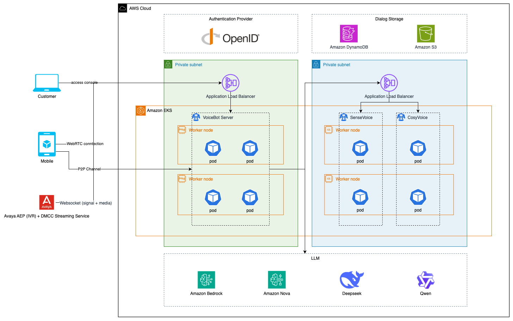
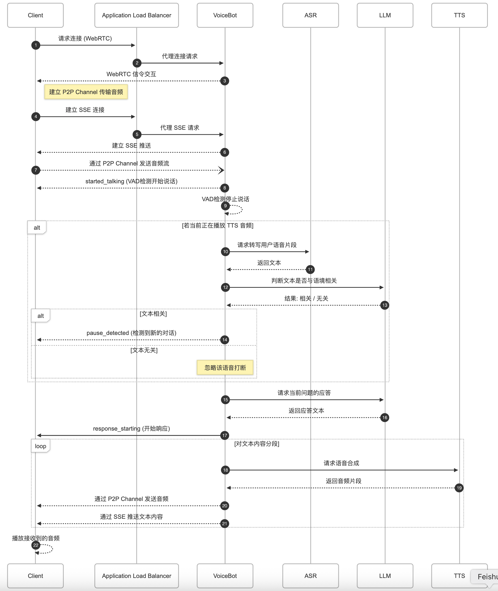
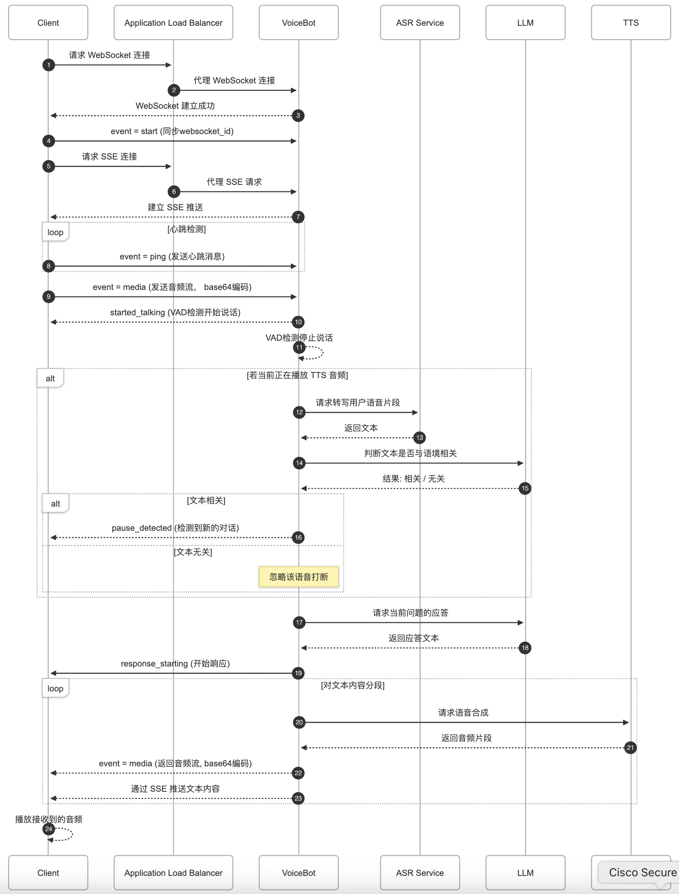

# Agentic Voice Assistant on AWS

## Architecture



This asset consists of the following core components:

* Voice Bot Server: Enables complete Speech-to-Speech conversation loop for real-time voice interactions
    * Supports multi-protocol communication (WebRTC/WebSocket) for diverse calling scenarios
    * Real-time Voice Activity Detection (VAD) to filter out silence and non-speech segments
    * RNNoise-based noise suppression for enhanced audio quality in noisy environments
    * Contextual relevance analysis to prevent processing invalid requests
    * Integrates ASR (Automatic Speech Recognition) for speech-to-text conversion
    * Leverages LLM (Large Language Model) for intelligent response generation
    * Drives TTS (Text-to-Speech) for natural voice output
* Dialog Storage: Provides traceable conversation archives for quality monitoring and model optimization
    * DynamoDB: Stores structured conversation metadata (session ID, timestamps, user queries/bot responses) enabling context tracking and state management
    * S3: Secures raw call recordings for compliance auditing and speech analytics
* Speech Recognition (SenseVoice): The automatic speech recognition (ASR) system converts voice input into text, which is then processed by the LLM to generate contextual bot responses. These responses incorporate both the current stage in the workflow and relevant data retrieved from the knowledge base.
* Speech Synthesis (CosyVoice): The text-to-speech (TTS) system synthesizes natural-sounding voice output from generated text, providing bot designers with controls for speech style modulation, prosody adjustments, and strategic pause insertion.

### WebRTC Workflow



### WebSocket Workflow



## Getting started

### Prerequisites

- Make sure you have an AWS account
- Configure [credential of aws cli][configure-aws-cli]
- Install and Start Docker, and Ensure Your Computer's Network Can Access docker.io to Download Images
- Install Node.js LTS version 20.12.0 or later
- Initialize the CDK toolkit stack into AWS environment (only for deploying via [AWS CDK][aws-cdk] for the first time), and run `npx cdk bootstrap`
- You own a domain name and have already created an ACM certificate for it

## Deployment


**Step 1.** Install the project dependencies and build the project.

```bash
cd source/infrastructure
sudo npm install -g pnpm
pnpm install && pnpm projen && pnpm build
```

**Step 2.** Once done, run the configuration command to help you set up the solution with the features you need:

```bash
npm run config
```

You'll be prompted to configure the different aspects of the solution, such as:

- Select deployment region.
- Select VPC provisioning.
- Enter EKS cluster name.
- Select node instance type
- Enter ACM Certificate ARN

When done, answer `Y` to create or update your configuration.

Your configuration is now stored under `src/config.json`. You can re-run the `npm run config` command as needed to update your `config.json`

**Step 3.** Configure LLM Parameters​

After generating `config.json`, you need to update the large language model (LLM) configuration in voiceAssistant.litellmParams using any LiteLLM-supported models. Please refer to [Supported Models & Providers][litellm-providers] for the supported models and configurations.

**Configuration Example​:**
```json
{
  "voiceAssistant": {
    "litellmParams": {
      "model": "bedrock/anthropic.claude-3-5-sonnet-20241022-v2:0",
      "aws_region_name": "us-east-1"
    }
  }
}
```

**Step 4.** AWS CDK deploy on the target account and region

You can now deploy by running:

```bash
pnpm run deploy:eks
pnpm run deploy:plugin
pnpm run deploy:pod
```

> **Note**: This step duration can vary greatly, depending on the Constructs you are deploying.

You can view the progress of your CDK deployment in the [CloudFormation console](https://console.aws.amazon.com/cloudformation/home) in the selected region.

**Step 5.** Once deployed, take note of the `EKSConfigCommand`, `VoicebotLoadBalancerHostName`.

```bash
 ✅  AgenticVoiceAssistantOnAWS

✨  Deployment time: 977.15s

Outputs:
AgenticVoiceAssistantOnAWS.EKSConfigCommand = aws eks update-kubeconfig --name voice-assistant --region us-east-1 --role-arn arn:aws:iam::123456789012:role/AgenticVoiceAssistantOnAW-EKSAccessEntryRole-kE
AgenticVoiceAssistantOnAWS.StunnerLoadBalancerHostName = k8s-voiceass-stunnerg-xxxxx-xxxxx.elb.us-east-1.amazonaws.com
AgenticVoiceAssistantOnAWS.VoicebotLoadBalancerHostName = k8s-voiceass-voicebot-xxxxx-xxxxx.us-east-1.elb.amazonaws.com
...
```

**Step 6.** Login VoiceAssistant

Please note that the initial deployment requires downloading Docker images and initializing services. We recommend waiting at least 20 minutes after deployment completion before accessing the test page to ensure all components are fully operational.

Login to the console using stack output: `VoicebotLoadBalancerHostName`

## Testing Your Voicebot Application

This testing approach provides a controlled environment to validate your voicebot's conversation capabilities before production deployment.

### Running the Voicebot Service

```
python app.py
```

### Setting Up the Test Environment

Navigate to the example directory:

```
cd example
```

Install the required dependencies:

```
pip install -r requirements.txt
```

### Simulating a Phone Call

Execute the telephone simulator by running, Replace {VOICEBOT_DNS_NAME} with your actual voicebot service DNS name or IP address:

```
python telephone.py wss://{VOICEBOT_DNS_NAME}
```

**Step 7.** Destroy

You can destroy by running:

```bash
pnpm run destroy:pod
pnpm run destroy:plugin
pnpm run destroy:eks
```

## Appendix

### App.1: Build Image by yourself

In the Docker directory, there are six components that need to be built. Among them, ​**​cosyvoice​**​​, ​​**​sensevoice​**​​, and ​​**​voicebot​**​​ have longer build times, so it is recommended that you build ​**​stunner-auth-server​​​**, ​**​​stunner-gateway-operator​**​​, and ​**​​stunnerd​​​** are designed to address the issue of being unable to pull images from docker.io in China. You do not need to build them manually—they will be handled automatically by the CDK.

Please create the corresponding repositories in your ECR in advance. Then, navigate to the directory of each component you wish to build and execute the following example command:

```bash
aws ecr get-login-password --region {YOUR REGION NAME} | docker login --username AWS --password-stdin {YOUR ACCOUNT ID}.dkr.ecr.{YOUR REGION NAME}.amazonaws.com
cd docker/voicebot
docker build -t agentic-voice-assistant-on-aws/voicebot .
docker tag agentic-voice-assistant-on-aws/voicebot:latest {YOUR ACCOUNT ID}.dkr.ecr.{YOUR REGION NAME}.amazonaws.com/agentic-voice-assistant-on-aws/voicebot:v1.2.0
docker push {YOUR ACCOUNT ID}.dkr.ecr.{YOUR REGION NAME}.amazonaws.com/agentic-voice-assistant-on-aws/voicebot:v1.2.0
```

### App.2: How to complete deployment using your own built images

After the image is built, you can obtain the URI of the corresponding image. You can modify the image address for the relevant component in the config.jsonfile generated after running pnpm run config. If the image field is empty, the CDK will automatically build the image. If an image URI is specified, the image will be pulled directly from that location. A configuration example is provided below:

```json
{
  "stt": {
      "image": "{YOUR ACCOUNT ID}.dkr.ecr.{YOUR REGION NAME}.amazonaws.com/agentic-voice-assistant-on-aws/sensevoice:v1.2.0",
      "name": "sensevoice",
      "port": 50000,
      "replicas": 1,
  },
}
```

[configure-aws-cli]: https://docs.aws.amazon.com/zh_cn/cli/latest/userguide/cli-chap-configure.html
[aws-cdk]: https://aws.amazon.com/cdk/
[install-kubectl-linux]: https://kubernetes.io/docs/tasks/tools/install-kubectl-linux/
[litellm-providers]: https://docs.litellm.ai/docs/providers